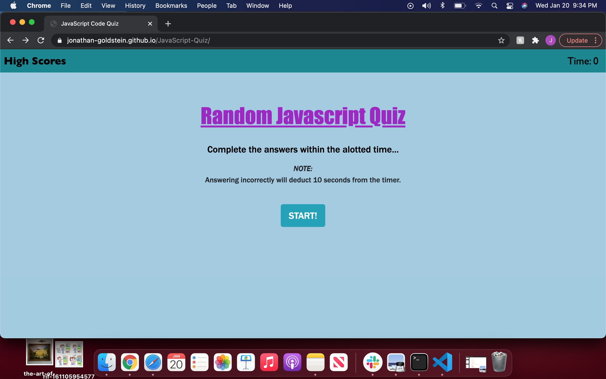
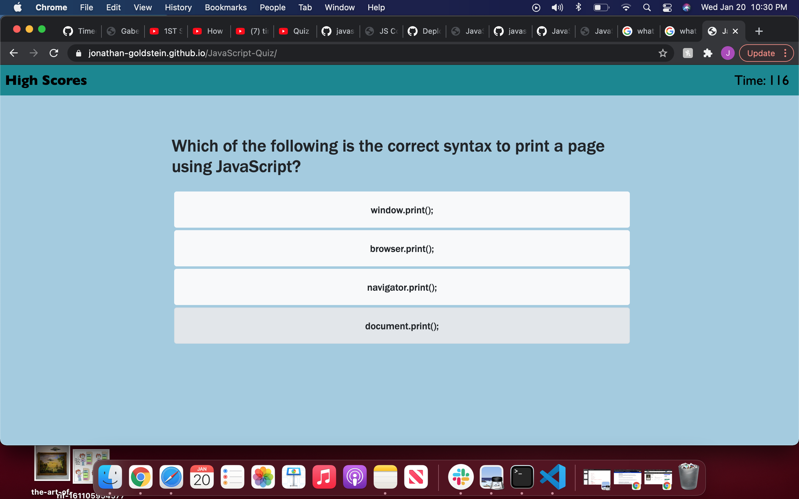
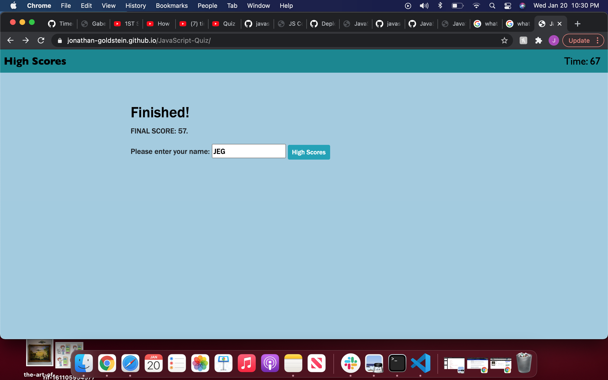

## Task:
As a coding boot camp student, I wanted to make a quiz on JavaScript fundamentals that stored high scores. This way I can gauge my progress compared to my peers.

## The Application:

1.) I was required to create an application using primarilly Javascript that conducts a multiple choice quiz.  Below describes how the website functions:

2.) Upon clicking the start button, the user is presented with the first question and the timer begins the countdown. 

3.) Upon answering a question correctly or incorrectly they are presented with the following question.

4.) Ten seconds is deducted from the timer if they answer incorrectly.

5.) When the timer runs out or the user answers every question, the quiz ends and the user is directed to save their score.

6.) The high score pages stores the names and scores of those who played the game, but the user has the option of resetting the scores to null.

7.) The high scores can be viewed at any time by clicking on the link at the top left of the page.

## Link to the website:

https://jonathan-goldstein.github.io/JavaScript-Quiz/

## Below are images showing the functional webpage:

#The landing page:

#The multiple choice questions:

#The input for the user's name or initials:

#The high scores page:

